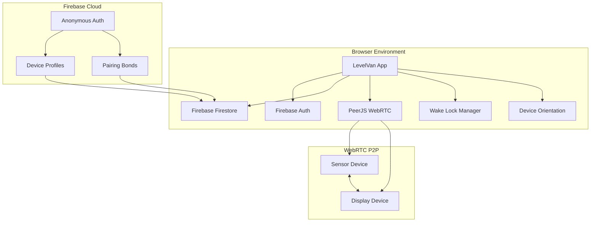

# Design Document: Persistent Pairing and Always-On Display

## Overview

This design document specifies the technical implementation for adding persistent pairing and always-on display functionality to the LevelVan caravan leveling system. The enhancement will transform the current session-based PIN pairing into a cloud-persistent system that automatically reconnects devices and maintains aggressive screen wake locks throughout the leveling process.

### Current System Analysis

The existing LevelVan implementation (`TravelGames/levelvan.html`) uses:
- **PeerJS** for WebRTC peer-to-peer connections with 4-digit PIN-based pairing
- **localStorage** for basic session persistence (currently minimal)
- **Screen Wake Lock API** (basic implementation)
- **DeviceOrientation API** for sensor data collection
- **Real-time data transmission** at ~15Hz over WebRTC data channels

### Enhancement Goals

1. **Replace localStorage with Firebase Firestore** for cloud-based device identity and pairing persistence
2. **Implement automatic role detection** and zero-interaction startup for previously paired devices
3. **Enhance wake lock implementation** to be Netflix-like in aggressiveness
4. **Add device identity management** using Firebase Anonymous Authentication
5. **Maintain backward compatibility** with existing PIN-based pairing workflow
6. **Add pairing reset functionality** for troubleshooting and device changes

## Architecture

### High-Level Architecture



### Component Architecture

The enhanced system will maintain the existing component structure while adding new cloud persistence and wake lock management layers:

1. **Cloud Persistence Layer** (New)
   - Firebase Authentication (Anonymous)
   - Firebase Firestore for device profiles and pairing bonds
   - Offline persistence with automatic synchronization

2. **Enhanced Wake Lock Manager** (New)
   - Aggressive wake lock acquisition and monitoring
   - Multiple fallback strategies for wake lock maintenance
   - Recovery mechanisms for lost wake locks

3. **Device Identity Manager** (New)
   - Persistent device identification across sessions
   - Automatic role detection and mode selection
   - Pairing bond management and reset functionality

4. **Existing Components** (Enhanced)
   - PeerJS WebRTC connections (enhanced with automatic reconnection)
   - Sensor data collection (unchanged)
   - UI components (enhanced with connection status indicators)

## Components and Interfaces

### Firebase Integration Module

**Purpose**: Manages cloud-based device identity and pairing persistence

**Key Functions**:
```javascript
class FirebaseManager {
  async initializeFirebase()
  async authenticateAnonymously()
  async getOrCreateDeviceProfile()
  async createPairingBond(sensorId, displayId)
  async findExistingPairingBond(deviceId)
  async resetPairingBond(deviceId)
  async updateDeviceLastActive(deviceId)
}
```

**Firebase Configuration**:
- Project setup with Firestore and Anonymous Authentication enabled
- Security rules allowing authenticated users to read/write their own device profiles
- Offline persistence enabled for seamless operation during network interruptions

### Enhanced Wake Lock Manager

**Purpose**: Provides Netflix-like aggressive screen wake lock management

**Key Functions**:
```javascript
class WakeLockManager {
  async requestWakeLock()
  async releaseWakeLock()
  startWakeLockMonitoring()
  stopWakeLockMonitoring()
  handleVisibilityChange()
  handleWakeLockRelease()
  displayWakeLockStatus()
}
```

**Wake Lock Strategies**:
1. **Primary**: Screen Wake Lock API (supported in all modern browsers as of 2024)
2. **Monitoring**: 10-second interval checks with automatic re-acquisition
3. **Event Handling**: Visibility API monitoring for tab focus changes
4. **Recovery**: Immediate re-request on unexpected wake lock release
5. **Fallback**: User interaction simulation for older browsers (if needed)

### Device Identity Manager

**Purpose**: Manages persistent device identification and automatic pairing

**Key Functions**:
```javascript
class DeviceIdentityManager {
  async initializeDeviceIdentity()
  async detectExistingRole()
  async attemptAutomaticConnection()
  async handleConnectionFailure()
  getDeviceProfile()
  updateDeviceRole(role)
}
```

**Device Profile Schema**:
```javascript
{
  deviceId: "uuid-v4-string",
  userId: "firebase-anonymous-uid", 
  deviceType: "sensor" | "display",
  createdAt: timestamp,
  lastActiveAt: timestamp,
  activePairId: "shared-pair-uuid" | null,
  browserInfo: {
    userAgent: string,
    platform: string
  }
}
```

### Enhanced Connection Manager

**Purpose**: Extends existing PeerJS functionality with automatic reconnection and cloud integration

**Key Functions**:
```javascript
class ConnectionManager {
  async initializeWithCloudData()
  async attemptAutomaticConnection(pairId)
  async fallbackToPinEntry()
  handleNetworkReconnection()
  updateConnectionStatus(status)
  retryConnectionWithBackoff()
}
```

**Connection States**:
- `initializing`: Setting up cloud data and device identity
- `auto-connecting`: Attempting automatic connection with existing pair
- `pin-entry`: Fallback to manual PIN entry
- `connected`: Active WebRTC connection established
- `reconnecting`: Attempting to restore lost connection
- `offline`: No network connectivity, local functionality only

## Data Models

### Device Profile (Firestore Document)

**Collection**: `deviceProfiles`
**Document ID**: Firebase Anonymous UID

```javascript
{
  deviceId: "550e8400-e29b-41d4-a716-446655440000",
  deviceType: "sensor" | "display" | null,
  createdAt: "2024-01-15T10:30:00Z",
  lastActiveAt: "2024-01-15T14:45:00Z", 
  activePairId: "pair-uuid-v4" | null,
  browserFingerprint: {
    userAgent: "Mozilla/5.0...",
    platform: "MacIntel",
    language: "en-US"
  },
  preferences: {
    autoConnect: true,
    wakeLockEnabled: true
  }
}
```

### Pairing Bond (Firestore Document)

**Collection**: `pairingBonds`
**Document ID**: Shared pair UUID

```javascript
{
  pairId: "pair-550e8400-e29b-41d4-a716-446655440000",
  sensorDeviceId: "device-uuid-1",
  displayDeviceId: "device-uuid-2", 
  sensorUserId: "firebase-uid-1",
  displayUserId: "firebase-uid-2",
  createdAt: "2024-01-15T10:30:00Z",
  lastConnectionAt: "2024-01-15T14:45:00Z",
  status: "active" | "reset" | "inactive",
  connectionHistory: [
    {
      timestamp: "2024-01-15T14:45:00Z",
      event: "connected" | "disconnected" | "created" | "reset"
    }
  ]
}
```

### Firestore Security Rules

```javascript
rules_version = '2';
service cloud.firestore {
  match /databases/{database}/documents {
    // Device profiles - users can only access their own
    match /deviceProfiles/{userId} {
      allow read, write: if request.auth != null && request.auth.uid == userId;
    }
    
    // Pairing bonds - users can access bonds they're part of
    match /pairingBonds/{pairId} {
      allow read, write: if request.auth != null && 
        (request.auth.uid == resource.data.sensorUserId || 
         request.auth.uid == resource.data.displayUserId);
    }
  }
}
```

## Implementation Strategy

### Phase 1: Firebase Integration Foundation

1. **Add Firebase SDK** to the existing HTML file
2. **Initialize Firebase** with project configuration
3. **Implement Anonymous Authentication** on app startup
4. **Create Device Profile management** functions
5. **Add Firestore offline persistence** configuration

### Phase 2: Enhanced Wake Lock Implementation

1. **Replace basic wake lock** with comprehensive WakeLockManager
2. **Add wake lock monitoring** with 10-second intervals
3. **Implement visibility change handling** for tab switching
4. **Add wake lock status indicators** to the UI
5. **Test wake lock persistence** across various scenarios

### Phase 3: Automatic Pairing System

1. **Implement device identity detection** on startup
2. **Add automatic role selection** based on device profile
3. **Create pairing bond management** functions
4. **Integrate automatic connection** with existing PeerJS flow
5. **Add fallback to PIN entry** when automatic connection fails

### Phase 4: Enhanced Connection Management

1. **Add network resilience** with exponential backoff retry
2. **Implement connection status indicators** in the UI
3. **Add pairing reset functionality** to settings/help
4. **Enhance error handling** with user-friendly messages
5. **Add connection history tracking** for debugging

### Phase 5: Testing and Optimization

1. **Test offline/online scenarios** with network interruptions
2. **Verify wake lock persistence** across device orientations and app switching
3. **Test automatic pairing** with multiple device combinations
4. **Optimize Firebase queries** for minimal data usage
5. **Performance testing** with multiple concurrent connections

## Specific Code Integration Points

### Firebase Configuration (Added to `<head>`)

```html
<!-- Firebase SDK v9 (modular) -->
<script type="module">
  import { initializeApp } from 'https://www.gstatic.com/firebasejs/10.7.1/firebase-app.js';
  import { getAuth, signInAnonymously } from 'https://www.gstatic.com/firebasejs/10.7.1/firebase-auth.js';
  import { getFirestore, enableIndexedDbPersistence } from 'https://www.gstatic.com/firebasejs/10.7.1/firebase-firestore.js';
  
  // Firebase configuration will be added here
  const firebaseConfig = {
    // Project-specific configuration
  };
  
  window.firebaseApp = initializeApp(firebaseConfig);
  window.firebaseAuth = getAuth();
  window.firebaseDb = getFirestore();
  
  // Enable offline persistence
  enableIndexedDbPersistence(window.firebaseDb).catch(err => {
    console.warn('Firestore persistence failed:', err);
  });
</script>
```

### Enhanced Startup Flow (Modified `window.addEventListener('load')`)

```javascript
window.addEventListener('load', async () => {
  // Initialize Firebase and device identity
  await initializeCloudServices();
  
  // Check for shared link (existing functionality)
  if (_hash.startsWith('LVP:')) {
    const pin = _hash.slice(4);
    mode = 'display';
    showScreen('display-screen');
    showPanel('d1');
    setTimeout(() => fillPin(pin), 300);
    return;
  }
  
  // Attempt automatic connection for existing pairs
  const autoConnected = await attemptAutomaticConnection();
  if (!autoConnected) {
    showScreen('home-screen');
  }
});
```

### Wake Lock Integration (Enhanced throughout sensor/display modes)

```javascript
class WakeLockManager {
  constructor() {
    this.wakeLock = null;
    this.monitoringInterval = null;
    this.isMonitoring = false;
  }
  
  async requestWakeLock() {
    if ('wakeLock' in navigator) {
      try {
        this.wakeLock = await navigator.wakeLock.request('screen');
        this.wakeLock.addEventListener('release', () => {
          console.log('Wake lock released');
          this.handleWakeLockRelease();
        });
        this.updateWakeLockStatus(true);
        return true;
      } catch (err) {
        console.warn('Wake lock request failed:', err);
        this.updateWakeLockStatus(false);
        return false;
      }
    }
    return false;
  }
  
  startMonitoring() {
    if (this.isMonitoring) return;
    this.isMonitoring = true;
    
    // Monitor every 10 seconds
    this.monitoringInterval = setInterval(() => {
      if (!this.wakeLock || this.wakeLock.released) {
        this.requestWakeLock();
      }
    }, 10000);
    
    // Handle visibility changes
    document.addEventListener('visibilitychange', () => {
      if (!document.hidden && (!this.wakeLock || this.wakeLock.released)) {
        this.requestWakeLock();
      }
    });
  }
}
```

## Error Handling

### Firebase Connection Errors

1. **Network Unavailable**: Queue operations for retry when connectivity returns
2. **Authentication Failures**: Retry anonymous authentication with exponential backoff
3. **Firestore Quota Exceeded**: Display user-friendly message and fall back to localStorage
4. **Security Rule Violations**: Log error and attempt to recreate device profile

### Wake Lock Failures

1. **API Unavailable**: Display warning and provide manual keep-awake instructions
2. **Permission Denied**: Show user guidance for enabling wake lock permissions
3. **Unexpected Release**: Immediately attempt to re-acquire wake lock
4. **Browser Compatibility**: Implement fallback strategies for older browsers

### Connection Failures

1. **Automatic Connection Timeout**: Fall back to PIN entry after 30 seconds
2. **WebRTC Signaling Failures**: Retry with exponential backoff, max 5 attempts
3. **Peer Unavailable**: Clear pairing bond and return to home screen
4. **Network Interruption**: Maintain local functionality and auto-reconnect when possible

## Correctness Properties

*A property is a characteristic or behavior that should hold true across all valid executions of a system-essentially, a formal statement about what the system should do. Properties serve as the bridge between human-readable specifications and machine-verifiable correctness guarantees.*

### Property 1: Device Profile Data Integrity

*For any* device profile created or retrieved by the system, the profile SHALL contain all required fields (deviceId, deviceType, createdAt, lastActiveAt) with valid data types and the deviceId SHALL be unique across all profiles.

**Validates: Requirements 1.2, 1.5, 2.2**

### Property 2: Pairing Bond Creation and Management

*For any* two devices that successfully complete pairing, the system SHALL create a pairing bond containing both device identifiers and a shared Active_Pair_ID, and this bond SHALL persist until explicitly reset by user action.

**Validates: Requirements 2.1, 2.2, 2.6**

### Property 3: Automatic Connection Behavior

*For any* device with an existing pairing bond, when the device starts, the system SHALL automatically detect the pairing bond, enter the appropriate mode (sensor or display), and initiate connection to the paired device without requiring user input.

**Validates: Requirements 2.3, 2.4, 3.1, 3.2, 3.3, 6.4**

### Property 4: Connection Timeout and Fallback

*For any* automatic connection attempt that fails, if the connection is not established within 30 seconds, the system SHALL offer manual PIN entry as a fallback option.

**Validates: Requirements 3.5**

### Property 5: Wake Lock Persistence and Recovery

*For any* device in sensor or display mode, the system SHALL maintain an active wake lock across all user interactions (orientation changes, app switching, focus changes, network interruptions), and SHALL automatically re-acquire the wake lock within 10 seconds if it is unexpectedly released.

**Validates: Requirements 4.1, 4.3, 4.4, 4.6, 4.7, 9.1, 9.2, 9.6**

### Property 6: Network Resilience and Reconnection

*For any* active session that experiences network connectivity loss, the system SHALL maintain local functionality, automatically attempt reconnection when connectivity returns using exponential backoff (1s, 2s, 4s, 8s, max 30s), and resume data transmission without user intervention upon successful reconnection.

**Validates: Requirements 5.1, 5.2, 5.3, 5.4, 5.6**

### Property 7: Zero-Interaction Startup Performance

*For any* previously paired device loading the application, the system SHALL automatically enter the appropriate mode and establish connection within 3 seconds, or display the home screen with error messaging if automatic setup fails.

**Validates: Requirements 6.1, 6.3, 6.5**

### Property 8: Pairing Reset Completeness

*For any* pairing reset operation, the system SHALL remove the pairing bond from cloud storage, clear the Active_Pair_ID from both device profiles, notify the paired device of disconnection, and return both devices to the home screen requiring manual mode selection.

**Validates: Requirements 7.2, 7.3, 7.4, 7.6**

### Property 9: Error Handling and User Communication

*For any* error condition (cloud storage conflicts, wake lock failures, connection failures), the system SHALL handle the error gracefully, display user-friendly error messages, and provide appropriate recovery options without breaking core functionality.

**Validates: Requirements 8.5, 8.6, 9.5**

### Property 10: Backward Compatibility Preservation

*For any* existing functionality (PIN-based pairing, shared links, bookmarks), the system SHALL continue to work correctly even when cloud storage is declined or unavailable, and SHALL provide clear migration paths when cloud features are available.

**Validates: Requirements 10.1, 10.2, 10.3, 10.4, 10.5**

## Testing Strategy

### Unit Testing Approach

**Dual Testing Strategy**:
- **Unit tests**: Verify specific examples, edge cases, and error conditions for UI interactions and integration points
- **Property tests**: Verify universal properties across all inputs using fast-check library for comprehensive input coverage
- **Integration tests**: Verify external service interactions (Firebase, WebRTC, Wake Lock API) with representative examples

**Property-Based Testing Configuration**:
- Library: **fast-check** (JavaScript property-based testing library)
- Minimum **100 iterations** per property test to ensure comprehensive input coverage
- Each property test tagged with: **Feature: persistent-pairing-always-on, Property {number}: {property_text}**

**Property Test Implementation Requirements**:

1. **Property 1 Tests**: Generate random device profiles with varying field combinations and verify data integrity
2. **Property 2 Tests**: Generate random device pairs and verify pairing bond creation and persistence
3. **Property 3 Tests**: Generate random devices with existing pairing bonds and verify automatic connection behavior
4. **Property 4 Tests**: Generate random connection failure scenarios and verify timeout/fallback behavior
5. **Property 5 Tests**: Generate random user interaction sequences and verify wake lock persistence
6. **Property 6 Tests**: Generate random network interruption patterns and verify resilience behavior
7. **Property 7 Tests**: Generate random previously paired devices and verify startup performance
8. **Property 8 Tests**: Generate random pairing reset scenarios and verify complete cleanup
9. **Property 9 Tests**: Generate random error conditions and verify graceful handling
10. **Property 10 Tests**: Generate random backward compatibility scenarios and verify functionality preservation

**Unit Test Focus Areas**:
- UI element presence and interaction (reset buttons, status indicators, loading screens)
- Specific error message content and formatting
- Integration with Firebase SDK methods
- WebRTC connection establishment flows
- Wake Lock API interaction patterns

**Integration Test Scenarios**:

1. **Firebase Authentication and Data Operations**: Verify anonymous auth, device profile CRUD, pairing bond management
2. **Wake Lock API Integration**: Verify wake lock acquisition, release, and monitoring across different browsers
3. **WebRTC Connection Management**: Verify PeerJS integration with automatic reconnection and fallback
4. **Offline/Online Synchronization**: Verify Firebase offline persistence and data synchronization
5. **Cross-Device Communication**: Verify pairing, data transmission, and disconnection notifications

## Error Handling

### Firebase Integration Errors

**Authentication Failures**:
- **Cause**: Network issues, Firebase service unavailable, quota exceeded
- **Handling**: Retry with exponential backoff (1s, 2s, 4s, max 10s), fall back to localStorage if persistent failure
- **User Experience**: Display "Connecting to cloud..." with retry indicator, graceful degradation message

**Firestore Operation Failures**:
- **Cause**: Network interruption, security rule violations, quota limits
- **Handling**: Queue operations for retry, use cached data when available, provide offline functionality
- **User Experience**: Show offline indicator, queue status, automatic retry notifications

**Data Synchronization Conflicts**:
- **Cause**: Multiple devices modifying same pairing bond simultaneously
- **Handling**: Use timestamp-based conflict resolution (most recent wins), merge compatible changes
- **User Experience**: Transparent resolution, notification if manual intervention needed

### Wake Lock Management Errors

**API Unavailable**:
- **Cause**: Older browsers, disabled features, security restrictions
- **Handling**: Detect capability, provide fallback strategies, user guidance
- **User Experience**: Clear warning message, manual keep-awake instructions, alternative approaches

**Permission Denied**:
- **Cause**: User denied wake lock permission, browser policy restrictions
- **Handling**: Request permission gracefully, provide manual alternatives
- **User Experience**: Permission request explanation, manual screen management guidance

**Unexpected Wake Lock Release**:
- **Cause**: System power management, browser tab switching, OS interruption
- **Handling**: Immediate re-acquisition attempt, monitoring and recovery
- **User Experience**: Brief notification if re-acquisition fails, manual re-enable option

### Connection and Network Errors

**WebRTC Connection Failures**:
- **Cause**: Network configuration, firewall restrictions, peer unavailable
- **Handling**: Retry with exponential backoff, fall back to PIN entry, clear error messaging
- **User Experience**: Connection status indicators, retry progress, fallback options

**Network Interruption During Active Session**:
- **Cause**: WiFi disconnection, mobile data loss, network switching
- **Handling**: Maintain local functionality, automatic reconnection attempts, data queuing
- **User Experience**: Offline indicator, reconnection progress, seamless resume when possible

**Pairing Bond Corruption**:
- **Cause**: Data corruption, incomplete synchronization, concurrent modifications
- **Handling**: Validate pairing bond integrity, recreate if corrupted, user notification
- **User Experience**: Automatic repair attempt, option to reset pairing if repair fails

### Graceful Degradation Strategy

**Cloud Services Unavailable**:
- Fall back to localStorage for device identity
- Maintain PIN-based pairing functionality
- Disable automatic reconnection features
- Provide clear offline mode indicators

**Wake Lock Failures**:
- Display manual screen management instructions
- Provide audio/vibration alerts for user attention
- Implement user interaction prompts to maintain activity
- Show battery usage warnings for manual management

**WebRTC Connection Issues**:
- Maintain sensor data collection locally
- Provide manual connection retry options
- Display clear troubleshooting guidance
- Fall back to solo mode operation when appropriate

### Browser Compatibility Testing

- **Chrome 85+**: Full Screen Wake Lock API support
- **Firefox 124+**: Full Screen Wake Lock API support  
- **Safari 16+**: Full Screen Wake Lock API support
- **Edge 85+**: Full Screen Wake Lock API support
- **Mobile browsers**: iOS Safari, Chrome Mobile, Samsung Internet

### Performance Testing

- **Firebase Query Optimization**: Minimize reads/writes for cost efficiency
- **Wake Lock Battery Impact**: Monitor battery usage during extended sessions
- **WebRTC Performance**: Ensure 15Hz data transmission remains stable
- **Offline Sync Performance**: Test large pairing bond synchronization
