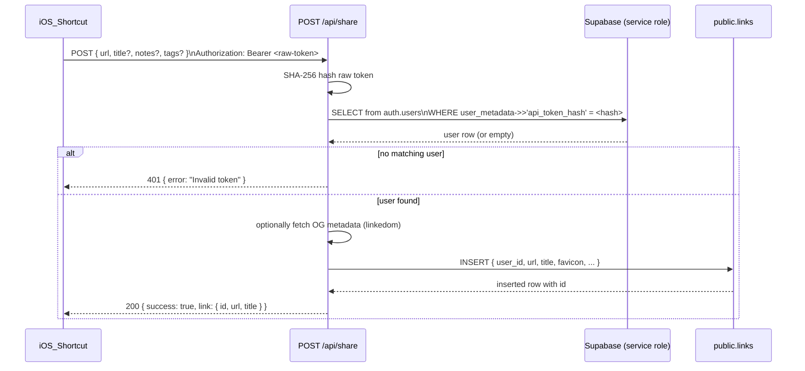
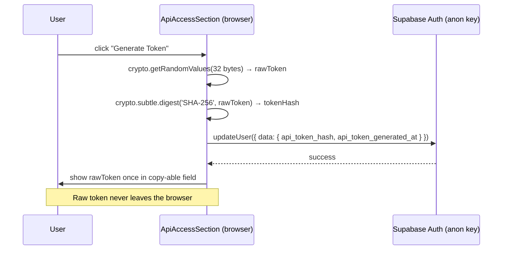

# Design Document: iOS Share Sheet API Integration

## Overview

This feature adds a secure API token mechanism that allows users to save links to SaveMyLinks from the iOS Share Sheet without opening the web app. The integration has two sides:

1. **Server side** — a new Cloudflare Pages Function (`functions/api/share.js`) that authenticates incoming requests using a hashed API token, optionally scrapes metadata, and inserts a link row via the Supabase service-role client.
2. **Client side** — a new `ApiAccessSection` component (mounted inside `UpdateProfileModal`) that lets users generate, inspect, and revoke their API token. Token generation happens entirely in the browser using the Web Crypto API; only the SHA-256 hash reaches Supabase.

The design deliberately reuses the existing linkedom metadata-scraping logic from `fetch-metadata.js` and the `supabase.auth.updateUser` pattern already used in `UpdateProfileModal`.

---

## Architecture





---

## Components and Interfaces

### `functions/api/share.js`

A Cloudflare Pages Function. It exports two named handlers following the Pages Functions file-based routing convention:

```js
export async function onRequestOptions(context) { /* CORS preflight */ }
export async function onRequestPost(context) { /* main handler */ }
```

Key responsibilities:
- Validate `Authorization: Bearer <token>` header
- Hash the raw token with `crypto.subtle.digest('SHA-256', ...)`
- Use the ServiceRoleClient to look up the user by `api_token_hash` in `auth.users`
- Validate the JSON body (`url` required)
- Optionally invoke `fetchMetadata(url)` (extracted helper, same logic as `fetch-metadata.js`)
- Insert into `public.links` using the ServiceRoleClient
- Return appropriate JSON responses with CORS headers on every path

### `src/components/ApiAccessSection.tsx`

A new React component, co-located with `UpdateProfileModal`. It accepts:

```ts
interface ApiAccessSectionProps {
  user: User | null;            // from useAuth()
  supabase: SupabaseClient | null; // from lib/supabase
  onUserUpdated?: () => void;   // optional callback after updateUser succeeds
}
```

Internal state:
```ts
interface ApiAccessState {
  status: 'idle' | 'generating' | 'error';
  generatedToken: string | null;  // raw token, held in memory only until dismissed
  error: string;
  revoking: boolean;
}
```

The component reads `user.user_metadata.api_token_generated_at` to determine whether a token already exists.

### `UpdateProfileModal.tsx` (modified)

The existing modal is extended to render `<ApiAccessSection>` below the existing profile form fields, separated by a divider. No changes to the existing form logic are required.

---

## Data Models

### Supabase `user_metadata` fields (schemaless JSON, no migration needed)

| Field | Type | Description |
|---|---|---|
| `api_token_hash` | `string \| null` | Hex-encoded SHA-256 hash of the raw ApiToken. Set on generation, cleared on revoke. |
| `api_token_generated_at` | `string \| null` | ISO-8601 timestamp of when the current token was generated. Used for status display and to detect an existing token. |

No additional tables or migrations are required. Supabase Auth `user_metadata` is schemaless JSON stored per-user and writable by the authenticated user via `updateUser` and by the server via the Admin API.

### `public.links` row inserted by ShareEndpoint

The inserted row uses the same schema already defined in the migration:

```ts
{
  user_id:    string,   // resolved from token lookup
  url:        string,   // from request body
  title:      string,   // from request body, or OG title, or url fallback
  favicon:    string | null,  // OG image URL from MetadataScraper, or null
  notes:      string,   // from request body, default ''
  tags:       string[], // from request body, default []
  starred:    false,    // always false for share-sheet insertions
}
```

### Token hashing algorithm

```
rawToken  = crypto.getRandomValues(new Uint8Array(32))
tokenHex  = Array.from(rawToken).map(b => b.toString(16).padStart(2,'0')).join('')
hashBuf   = await crypto.subtle.digest('SHA-256', rawToken)
tokenHash = Array.from(new Uint8Array(hashBuf)).map(b => b.toString(16).padStart(2,'0')).join('')
```

The same algorithm runs identically in both the browser (ApiAccessSection) and the Cloudflare Worker runtime (ShareEndpoint), since both expose the Web Crypto API.

---

## Correctness Properties

*A property is a characteristic or behavior that should hold true across all valid executions of a system — essentially, a formal statement about what the system should do. Properties serve as the bridge between human-readable specifications and machine-verifiable correctness guarantees.*

### Property 1: Missing or malformed Authorization always yields 401

*For any* request to `POST /api/share` that either has no `Authorization` header or has an `Authorization` header value that does not begin with `Bearer `, the ShareEndpoint SHALL respond with HTTP status 401, regardless of the request body content.

**Validates: Requirements 1.1, 1.2**

---

### Property 2: Unknown token always yields 401

*For any* Bearer token whose SHA-256 hex digest does not match any `api_token_hash` in the mocked user store, the ShareEndpoint SHALL respond with HTTP status 401.

**Validates: Requirements 1.3**

---

### Property 3: Missing or empty `url` field always yields 400

*For any* authenticated request whose JSON body lacks the `url` field or has `url` set to an empty string, the ShareEndpoint SHALL respond with HTTP status 400, regardless of what other fields are present.

**Validates: Requirements 2.2**

---

### Property 4: Non-JSON body always yields 400

*For any* string that cannot be parsed as JSON, submitting it as the request body to an otherwise-authenticated `POST /api/share` request SHALL yield HTTP status 400.

**Validates: Requirements 2.1**

---

### Property 5: CORS headers present on all responses

*For any* code path through the ShareEndpoint (auth failure, validation failure, server error, success), the response SHALL include `Access-Control-Allow-Origin: *`, `Access-Control-Allow-Methods: POST, OPTIONS`, and `Access-Control-Allow-Headers: Content-Type, Authorization`.

**Validates: Requirements 4.4**

---

### Property 6: Inserted link always carries the resolved user's ID

*For any* valid authenticated request with a non-empty `url`, the row inserted into `public.links` SHALL have `user_id` equal to the user ID resolved from the token lookup, regardless of what `user_id` value (if any) is present in the request body.

**Validates: Requirements 3.1**

---

### Property 7: Title fallback chain is always honoured

*For any* combination of (a) absent/empty request-body `title` and (b) MetadataScraper response (returns title, returns empty string, or throws), the `title` stored in the inserted link SHALL be: the scraped title if non-empty, otherwise the `url` string. A non-empty request-body `title` SHALL always take precedence over scraping.

**Validates: Requirements 3.2, 3.4**

---

### Property 8: MetadataScraper failure never blocks insertion

*For any* exception thrown by the MetadataScraper, the ShareEndpoint SHALL still insert the link and return HTTP 200, using the URL as the fallback title and `null` for favicon.

**Validates: Requirements 3.4, 3.5**

---

### Property 9: Token hash stored is always the SHA-256 of the generated token

*For any* invocation of "Generate Token" in the ApiAccessSection, the value passed as `api_token_hash` in the `updateUser` call SHALL equal the lowercase hex SHA-256 digest of the raw token that is displayed to the user.

**Validates: Requirements 5.2, 9.2**

---

### Property 10: Token hash never appears in rendered output

*For any* rendered state of the ApiAccessSection (no token, token active, during generation, after error), the value of `user_metadata.api_token_hash` SHALL NOT appear as text in the rendered component output.

**Validates: Requirements 6.3, 9.2**

---

### Property 11: Token status display reflects metadata correctly

*For any* valid ISO-8601 date string stored in `user_metadata.api_token_generated_at`, the ApiAccessSection SHALL render a human-readable status string that contains the year of that date and does not contain the ISO string verbatim.

**Validates: Requirements 6.1**

---

## Error Handling

| Scenario | HTTP Status | Response Body |
|---|---|---|
| Missing `Authorization` header | 401 | `{ "error": "Missing authorization header" }` |
| `Authorization` not `Bearer <token>` | 401 | `{ "error": "Invalid authorization format" }` |
| Token hash not found in user store | 401 | `{ "error": "Invalid token" }` |
| Body is not valid JSON | 400 | `{ "error": "Invalid JSON body" }` |
| `url` absent or empty | 400 | `{ "error": "url is required" }` |
| `SUPABASE_URL` / `SUPABASE_SERVICE_ROLE_KEY` missing from env | 500 | `{ "error": "Server misconfiguration" }` |
| Supabase insert error | 500 | `{ "error": "Failed to save link" }` |
| MetadataScraper error (non-fatal) | — | Logged as warning; insertion continues |

On the client side (`ApiAccessSection`):
- `updateUser` failures surface as a visible error string in the component; the raw token is never shown if the save failed.
- Revocation failures surface as a visible error string; the existing token state is left unchanged.

---

## Testing Strategy

### Unit and Property Tests (Vitest + fast-check)

The feature uses `vitest` (already the ecosystem standard for Vite-based projects) with `fast-check` for property-based testing.

**ShareEndpoint (`functions/api/share.js`)**

Property tests run against a pure helper function extracted from the handler (`processShareRequest(request, env)`), using a mock Supabase client and a mock `fetchMetadata`:

- **Property 1** — `fc.oneof(fc.string(), fc.constant(undefined))` for Authorization header (missing or malformed); assert status 401.
- **Property 2** — `fc.string()` for token values not in mock store; assert status 401.
- **Property 3** — `fc.record({...})` with url set to `fc.constant('')` or absent; assert status 400.
- **Property 4** — `fc.string().filter(s => { try { JSON.parse(s); return false } catch { return true } })`; assert status 400.
- **Property 5** — Run all error and success paths; assert all three CORS headers present on every response.
- **Property 6** — `fc.record({ url: fc.webUrl(), title: fc.option(fc.string()), notes: fc.option(fc.string()), tags: fc.option(fc.array(fc.string())) })`; verify inserted row `user_id` matches mock user.
- **Property 7** — Combinations of body title presence and mock scraper return values; verify title fallback chain.
- **Property 8** — Mock scraper to throw `fc.string()` as error message; verify 200 and insertion proceeds.

**ApiAccessSection (`src/components/ApiAccessSection.tsx`)**

Using `@testing-library/react` + `fast-check`:

- **Property 9** — Generate random 32-byte arrays; compute expected SHA-256 hex; render and simulate generate click with mocked `crypto`; assert `updateUser` receives the expected hash.
- **Property 10** — Render in all states with a known `api_token_hash` value; assert the hash string does not appear in `document.body.textContent`.
- **Property 11** — Generate random valid ISO date strings; render ApiAccessSection with that date in `user_metadata`; assert rendered text contains the 4-digit year and does not contain the full ISO string.

### Unit Tests (example-based)

- CORS preflight OPTIONS → 204 with headers (Requirement 4.4)
- Happy path end-to-end: valid token + valid body → 200 with correct shape (Requirement 3.5)
- Missing env vars → 500 (Requirement 4.3)
- DB insert failure → 500 (Requirement 3.6)
- Scraper returns OG image → stored in `favicon` (Requirement 3.3)
- Token already exists → confirm dialog shown (Requirement 5.5)
- Revoke token → updateUser called with nulls (Requirement 7.1)
- No token exists → revoke button absent (Requirement 7.4)
- No token in metadata → "No token generated" rendered (Requirement 6.2)

### Property Test Configuration

- Minimum 100 iterations per property test (`fc.assert(fc.property(...), { numRuns: 100 })`)
- Each test tagged: `// Feature: ios-share-integration, Property N: <property_text>`

### Integration / Smoke Tests

- Verify `functions/api/share.js` file exists with correct exports (Requirement 4.1)
- Verify `SUPABASE_SERVICE_ROLE_KEY` does not appear in any `src/` file (Requirement 9.3)
- Verify raw token is not logged in `share.js` (Requirement 9.1)

### What PBT Is NOT Used For

The user lookup that queries `auth.users` via the Supabase Admin API is an external-service call; integration is tested with a single example using a mock client rather than 100 property iterations.
